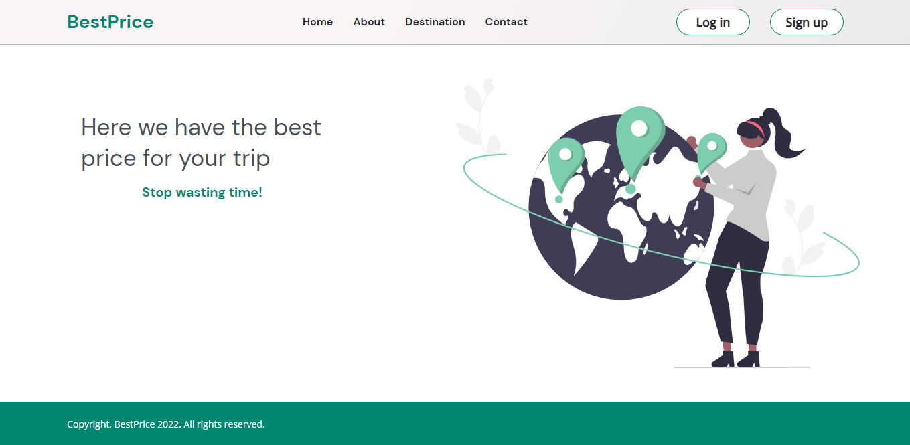

<h1 align="center"> Projeto "BestPrice" </h1>

O objetivo do projeto é de apresentar o modal utilizando javascript puro.

  <a href="#-tecnologias">Tecnologias</a>&nbsp;&nbsp;&nbsp;|&nbsp;&nbsp;&nbsp;
  <a href="#-projeto">Projeto</a>

 

  

## 💻 Tecnologias

Esse projeto foi desenvolvido com as seguintes tecnologias:

- HTML e CSS
- JavaScript

## 💡 Projeto

O BestPrice é uma página que apresenta na página princial dois o formulário. Sendo um para o usuário logar no site, e o outro para se cadastrar.

---

Feito por Samara Carvalho Coelho
